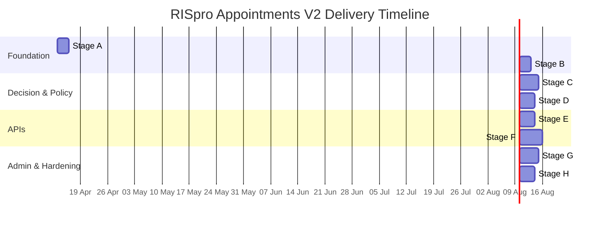

# Designing and Delivering Appointments V2 for RISpro

## Executive summary

RISpro’s current appointments/scheduling implementation already contains an “engine upgrade” layer (rules, quotas, overrides, audit events) but it is still operationally fragile because core behaviours are spread across: legacy API routes, a large appointment service, a rule evaluator, and a settings/admin persistence pipeline that is not truly authoritative. The observed symptom (“availability looks correct until advanced scheduling is touched, then everything becomes unavailable”) is consistent with a configuration/decision mismatch triggered by a refetch (advanced options change query keys), revealing blocked/restricted outcomes that were not being surfaced in the initial view (or were being masked by stale or inconsistent configuration). The repo contains explicit scheduling precedence notes and rollout guidance, including a shadow-mode strategy and in-transaction revalidation, which are good foundations to formalise into Appointments V2. fileciteturn16file0 fileciteturn18file0

Appointments V2 should be delivered as a parallel module (new folder boundary, new DB tables, new API surface, new tests), then cut over behind feature flags, and only then deprecate legacy. This matches the repo’s own production readiness checklist and reduces risk by keeping registration, queue, printing and current admin pages stable while V2 reaches parity. fileciteturn35file0 fileciteturn18file0

For a “proper” scheduling model, use a clear separation between “availability containers” and “bookings”, similar to HL7 FHIR’s separation of Schedule/Slot (availability) from Appointment (booking). This separation is explicitly motivated by privacy and access control (you can expose availability without exposing appointment details). citeturn2search0turn2search1turn2search2

For complex rule configuration, adopt a versioned configuration model. Decision-table approaches (e.g., OMG DMN) provide a standard way to express rule precedence and outcomes using “hit policies” and tabular rules, and they can be used even if you do not execute DMN directly (you can still store a decision-table-like configuration and compile it into code). citeturn1search0turn5search1turn5search3

## Legacy inventory and root-cause diagnosis

### Precise inventory of legacy scheduling files to mark or treat as frozen

The following files are the minimum “legacy scheduling surface area” in the repo that should be marked as frozen (or already is) because they directly implement scheduling decisions, booking constraints, scheduling admin persistence, and UI behaviours that will be replaced by V2:

| Area | File path | Why it is legacy scheduling surface |
|---|---|---|
| Backend routes | `src/routes/appointments.ts` | Legacy appointment endpoints including availability/suggestions/booking. fileciteturn7file0 |
| Backend service (monolith) | `src/services/appointment-service.ts` | Central legacy logic: availability, suggestions, create/update/cancel, concurrency strategy, quota consumption, override auditing. fileciteturn8file0 |
| Rule evaluation core | `src/domain/scheduling/evaluator.ts` | Core decision logic, precedence, decision shape, reason codes. fileciteturn10file0 |
| Rule evaluation DB adapter | `src/domain/scheduling/service.ts` | Loads rules/capacity/blocked rules from DB and feeds evaluator. fileciteturn9file0 |
| Rule types | `src/domain/scheduling/types.ts` | Shared decision/inputs/types; tightly coupled to legacy engine. fileciteturn11file0 |
| Admin scheduling config | `src/services/scheduling-settings-service.ts` | Writes/reads scheduling configuration; contains non-authoritative save patterns; will be replaced in V2. fileciteturn12file0 |
| General settings persistence | `src/services/settings-service.ts` | Stores/reads `system_settings` values in a way that can break scheduling flag interpretation if value shape is inconsistent. fileciteturn13file0 |
| Settings routes | `src/routes/settings.ts` | Exposes scheduling engine config endpoints and settings writes. fileciteturn14file0 |
| DB migrations (legacy scheduling schema) | `src/db/migrations/022_scheduling_engine_upgrade.sql` | Defines legacy scheduling engine tables and feature flags. fileciteturn20file0 |
| DB migrations (appointment workflow) | `src/db/migrations/001_initial.sql`, `003_appointments_workflow.sql` | Core appointment schema and constraints that legacy depends on. fileciteturn21file0turn19file0 |
| Docs describing legacy engine | `docs/scheduling-engine-notes.md`, `docs/scheduling-admin-guide.md`, `docs/scheduling-production-readiness-checklist.md` | Current intended precedence, admin semantics, rollout gates. fileciteturn16file0turn17file0turn18file0 |
| Backend tests (legacy scheduling behaviours) | `src/domain/scheduling/evaluator.test.ts`, `src/services/appointment-service.integration.test.ts`, `src/services/appointment-service.availability.test.ts`, `src/services/scheduling-settings-service.*.test.ts` | They encode legacy expectations; keep as regression only. fileciteturn25file0turn24file0turn22file0turn27file0 |
| Frontend booking + availability page | `frontend/src/pages/appointments/appointments-page.tsx` | Advanced scheduling toggles change availability query keys and refetch rule-aware availability. fileciteturn15file0 |
| Frontend scheduling admin UI | `frontend/src/pages/settings/settings-page.tsx` | Contains Scheduling Engine Config editor and settings writer patterns. fileciteturn31file0 |
| Frontend settings mapping | `frontend/src/lib/api-hooks.ts`, `frontend/src/lib/mappers.ts` | Controls how settings are saved/read; can create value-shape mismatches that break engine flags. fileciteturn32file0turn33file0 |

### Why “touching advanced scheduling” can flip availability to unavailable

In the current React appointments page, the availability query key includes advanced-option fields (`useSpecialQuota`, `specialReasonCode`, `includeOverrideCandidates`). Changing any of these forces a refetch of `/appointments/availability`. fileciteturn15file0

That refetch causes the backend to (re)compute bookability using the scheduling engine path (where enabled) and to attach decision fields such as `displayStatus`, `blockReasons`, and `is_bookable`. The UI then filters away rows with `displayStatus === "blocked"` unless “Show blocked dates” is enabled, which can produce the “everything disappears / becomes unavailable” perception if the refetch begins returning blocked decisions. fileciteturn15file0

Two repo-backed issues make such flips more likely:

* **Non-authoritative config saves in scheduling settings**: the scheduling config save service contains early-return patterns for empty arrays in multiple sync functions, meaning “sending an empty list” does not necessarily clear previously active rules; stale rules can remain active silently. This makes rule outcomes appear inconsistent and “sticky” after any admin edit cycle. fileciteturn12file0turn27file0  
* **Settings value-shape mismatch risk**: the backend reads `system_settings.setting_value` as an object with a `.value` field (e.g. `{"value":"enabled"}`), while the frontend settings save path can send raw strings. If raw strings are stored, backend readers that expect `.value` will behave differently (e.g., interpreting flags as empty/default). This can flip scheduling engine feature flags or other scheduling settings unexpectedly. fileciteturn13file0turn33file0turn32file0

Because these issues exist upstream of the actual decision logic, the safest and most “proper” fix is not to keep patching the legacy engine, but to build Appointments V2 with authoritative, versioned configuration and deterministic decision outputs.

## V2 target architecture and recommended folder structure

### A standards-aligned conceptual model

Use the same conceptual separation HL7 FHIR uses:

* **Schedule**: “a container for slots of time that may be available for booking appointments”, explicitly separated from appointment details to support privacy and security. citeturn2search0turn5search0  
* **Slot**: a bookable time unit that can be marked free/busy; it can also support multiple allocations up to a capacity. citeturn2search1  
* **Appointment**: the booking that references a slot/time window and participants/resources. citeturn2search2  

RISpro does not have to fully implement FHIR, but modelling V2 around “availability containers + bookable units + bookings” will keep the architecture predictable and extendable (e.g., later adding time-of-day slots, modality resources, or multi-machine capacity).

### Recommended V2 folder structure in this repo

The backend already routes under `/api/*` and uses `src/routes/*`, `src/services/*`, and `src/domain/*`. fileciteturn42file0  
Appointments V2 should live under a strict new root so multiple AI agents can work in parallel without stepping on legacy code:

```text
src/
  v2/
    appointments/
      index.ts                    # module wiring: exports router + public service surface
      api/
        routes/
          appointments-v2.ts      # booking endpoints
          scheduling-v2.ts        # availability + evaluate + suggestions
          admin-scheduling-v2.ts  # config versioning + publish
        dto/
          scheduling.dto.ts
          booking.dto.ts
          admin.dto.ts
      domain/
        decision/
          decision.ts             # pure decision types + reason codes
          evaluate.ts             # pure function evaluator (no DB)
        policy/
          policy.ts               # versioned policy model + validation
          compile.ts              # compile DB policy rows -> in-memory policy
        booking/
          allocate.ts             # transactional allocation algorithm
          invariants.ts           # invariants and idempotency rules
      infra/
        db/
          repositories/
            policy.repo.ts
            booking.repo.ts
            counters.repo.ts
          sql/
            queries.ts
      tests/
        unit/
        integration/
```

Frontend V2 should be equally isolated:

```text
frontend/src/
  v2/
    appointments/
      pages/
        appointments-v2.tsx
        scheduling-admin-v2.tsx
      api/
        hooks-v2.ts
        mappers-v2.ts
      components/
        AvailabilityCalendar.tsx
        OverrideDialog.tsx
```

This structure directly supports multi-agent work: one agent can implement `domain/decision` while another builds `infra/db/repositories`, and a third can build the admin UI, with minimal merge conflicts.

## Exact suggested V2 tables and schemas

The legacy engine created non-versioned rule tables (`modality_blocked_rules`, `exam_type_schedule_rules`, etc.). fileciteturn20file0  
Appointments V2 should introduce **versioned configuration** and **transaction-friendly booking state**. The DDL below creates a dedicated schema, policy versions, versioned rule tables, bookings, and a small “mutex row” mechanism for safe concurrent booking without advisory locks.

### DDL

```sql
-- ---------------------------------------------------------------------------
-- Appointments V2 schema
-- ---------------------------------------------------------------------------
create schema if not exists appointments_v2;

-- ---------------------------------------------------------------------------
-- Policy set + versioning (authoritative configuration)
-- ---------------------------------------------------------------------------
create table if not exists appointments_v2.policy_sets (
  id bigserial primary key,
  key text not null unique,                  -- e.g. 'default'
  name text not null,
  created_at timestamptz not null default now(),
  created_by_user_id bigint references users(id)
);

create table if not exists appointments_v2.policy_versions (
  id bigserial primary key,
  policy_set_id bigint not null references appointments_v2.policy_sets(id) on delete cascade,
  version_no integer not null,
  status text not null check (status in ('draft', 'published', 'archived')),
  based_on_version_id bigint references appointments_v2.policy_versions(id),
  config_hash text not null,                 -- sha256 of canonical JSON snapshot
  change_note text,
  created_at timestamptz not null default now(),
  created_by_user_id bigint references users(id),
  published_at timestamptz,
  published_by_user_id bigint references users(id),
  unique (policy_set_id, version_no)
);

create unique index if not exists policy_versions_one_published_per_set
  on appointments_v2.policy_versions(policy_set_id)
  where status = 'published';

-- ---------------------------------------------------------------------------
-- Versioned rule tables (all rules belong to a policy_version)
-- ---------------------------------------------------------------------------
create table if not exists appointments_v2.category_daily_limits (
  id bigserial primary key,
  policy_version_id bigint not null references appointments_v2.policy_versions(id) on delete cascade,
  modality_id bigint not null references modalities(id) on delete cascade,
  case_category text not null check (case_category in ('oncology', 'non_oncology')),
  daily_limit integer not null check (daily_limit >= 0),
  is_active boolean not null default true,
  unique (policy_version_id, modality_id, case_category)
);

create table if not exists appointments_v2.modality_blocked_rules (
  id bigserial primary key,
  policy_version_id bigint not null references appointments_v2.policy_versions(id) on delete cascade,
  modality_id bigint not null references modalities(id) on delete cascade,
  rule_type text not null check (rule_type in ('specific_date', 'date_range', 'yearly_recurrence')),
  specific_date date,
  start_date date,
  end_date date,
  recur_start_month smallint,
  recur_start_day smallint,
  recur_end_month smallint,
  recur_end_day smallint,
  is_overridable boolean not null default false,
  is_active boolean not null default true,
  title text,
  notes text
);

create index if not exists v2_modality_blocked_lookup
  on appointments_v2.modality_blocked_rules(policy_version_id, modality_id, is_active, rule_type, specific_date, start_date, end_date);

create table if not exists appointments_v2.exam_type_rules (
  id bigserial primary key,
  policy_version_id bigint not null references appointments_v2.policy_versions(id) on delete cascade,
  modality_id bigint not null references modalities(id) on delete cascade,
  rule_type text not null check (rule_type in ('specific_date', 'date_range', 'weekly_recurrence')),
  effect_mode text not null check (effect_mode in ('hard_restriction', 'restriction_overridable')),
  specific_date date,
  start_date date,
  end_date date,
  weekday smallint check (weekday between 0 and 6),
  alternate_weeks boolean not null default false,
  recurrence_anchor_date date,
  title text,
  notes text,
  is_active boolean not null default true
);

create index if not exists v2_exam_rules_lookup
  on appointments_v2.exam_type_rules(policy_version_id, modality_id, is_active, rule_type, specific_date, start_date, end_date, weekday);

create table if not exists appointments_v2.exam_type_rule_items (
  id bigserial primary key,
  rule_id bigint not null references appointments_v2.exam_type_rules(id) on delete cascade,
  exam_type_id bigint not null references exam_types(id) on delete cascade,
  unique (rule_id, exam_type_id)
);

create table if not exists appointments_v2.exam_type_special_quotas (
  id bigserial primary key,
  policy_version_id bigint not null references appointments_v2.policy_versions(id) on delete cascade,
  exam_type_id bigint not null references exam_types(id) on delete cascade,
  daily_extra_slots integer not null check (daily_extra_slots >= 0),
  is_active boolean not null default true,
  unique (policy_version_id, exam_type_id)
);

create table if not exists appointments_v2.special_reason_codes (
  code text primary key,
  label_ar text not null,
  label_en text not null,
  is_active boolean not null default true,
  created_at timestamptz not null default now(),
  updated_at timestamptz not null default now(),
  created_by_user_id bigint references users(id),
  updated_by_user_id bigint references users(id)
);

-- ---------------------------------------------------------------------------
-- Booking tables (V2 bookings; can map to legacy appointments during cutover)
-- ---------------------------------------------------------------------------
create table if not exists appointments_v2.bookings (
  id bigserial primary key,
  patient_id bigint not null references patients(id) on delete restrict,
  modality_id bigint not null references modalities(id) on delete restrict,
  exam_type_id bigint references exam_types(id) on delete restrict,
  reporting_priority_id bigint references reporting_priorities(id) on delete restrict,
  booking_date date not null,
  booking_time time,                                 -- null for day-level booking
  case_category text not null check (case_category in ('oncology', 'non_oncology')),
  status text not null check (status in ('scheduled', 'arrived', 'waiting', 'completed', 'no-show', 'cancelled')),
  notes text,
  policy_version_id bigint not null references appointments_v2.policy_versions(id) on delete restrict,
  created_at timestamptz not null default now(),
  created_by_user_id bigint references users(id),
  updated_at timestamptz not null default now(),
  updated_by_user_id bigint references users(id)
);

create index if not exists v2_bookings_bucket_idx
  on appointments_v2.bookings(modality_id, booking_date, case_category)
  where status <> 'cancelled';

-- ---------------------------------------------------------------------------
-- Override audit events (V2)
-- ---------------------------------------------------------------------------
create table if not exists appointments_v2.override_audit_events (
  id bigserial primary key,
  booking_id bigint references appointments_v2.bookings(id) on delete set null,
  patient_id bigint references patients(id) on delete set null,
  modality_id bigint references modalities(id) on delete set null,
  exam_type_id bigint references exam_types(id) on delete set null,
  booking_date date,
  requesting_user_id bigint references users(id),
  supervisor_user_id bigint references users(id),
  override_reason text,
  decision_snapshot jsonb not null default '{}'::jsonb,
  outcome text not null check (outcome in ('approved_and_booked', 'approved_but_failed', 'denied', 'cancelled')),
  created_at timestamptz not null default now()
);

-- ---------------------------------------------------------------------------
-- Mutex rows for safe concurrency (row-level locking instead of advisory locks)
-- ---------------------------------------------------------------------------
create table if not exists appointments_v2.bucket_mutex (
  modality_id bigint not null references modalities(id) on delete cascade,
  booking_date date not null,
  case_category text not null check (case_category in ('oncology', 'non_oncology')),
  -- optional: include exam_type_id if you later move to per-exam quotas at lock level
  created_at timestamptz not null default now(),
  primary key (modality_id, booking_date, case_category)
);
```

This schema intentionally mirrors the legacy rule concepts (blocked rules, exam-type rules, category limits, special quotas) while making them **version-scoped** and making bookings reference the policy version used at the time of booking. This gives you reproducibility (“why was this booking allowed?”) and safe policy evolution.

## API endpoints, DTOs, rule precedence, and decision object shape

### Exact endpoint naming (V2)

All endpoints sit alongside legacy routes under `/api`, but with a strict V2 prefix. The backend currently mounts only legacy routers (e.g., `/api/appointments`). fileciteturn42file0

Proposed V2 endpoints:

**Scheduling decision + availability**
- `POST /api/v2/scheduling/evaluate`
- `GET  /api/v2/scheduling/availability?modalityId=&days=&offset=&examTypeId=&caseCategory=&useSpecialQuota=&specialReasonCode=&includeOverrideCandidates=`
- `GET  /api/v2/scheduling/suggestions?modalityId=&days=&examTypeId=&caseCategory=&includeOverrideCandidates=`

**Booking**
- `POST /api/v2/appointments`
- `PUT  /api/v2/appointments/:id`
- `POST /api/v2/appointments/:id/cancel`

**Admin policy versioning**
- `GET  /api/v2/scheduling/policy` (returns published version + config snapshot)
- `POST /api/v2/scheduling/policy/draft` (creates draft based on published)
- `PUT  /api/v2/scheduling/policy/draft/:versionId` (authoritative replace of draft snapshot)
- `POST /api/v2/scheduling/policy/draft/:versionId/publish` (publish with optimistic concurrency)

### DTOs (TypeScript shapes)

```ts
// --- Request types ---
export type CaseCategory = "oncology" | "non_oncology";

export interface SchedulingCandidateDto {
  patientId: number;
  modalityId: number;
  examTypeId?: number | null;
  scheduledDate: string;              // ISO yyyy-mm-dd
  scheduledTime?: string | null;      // "HH:MM" or null
  caseCategory: CaseCategory;
  useSpecialQuota?: boolean;
  specialReasonCode?: string | null;
  includeOverrideEvaluation?: boolean;
}

export interface CreateBookingDto {
  patientId: number;
  modalityId: number;
  examTypeId?: number | null;
  reportingPriorityId?: number | null;
  bookingDate: string;                // ISO yyyy-mm-dd
  bookingTime?: string | null;
  caseCategory: CaseCategory;
  notes?: string | null;

  override?: {
    supervisorUsername: string;
    supervisorPassword: string;
    reason: string;
  };
}

// --- Decision shape ---
export type DecisionStatus = "available" | "restricted" | "blocked";

export type BlockReasonCode =
  | "modality_not_found"
  | "exam_type_not_found"
  | "exam_type_modality_mismatch"
  | "malformed_rule_configuration"
  | "modality_blocked_rule_match"
  | "modality_blocked_overridable"
  | "exam_type_not_allowed_for_rule"
  | "standard_capacity_exhausted"
  | "special_quota_exhausted";

export interface DecisionReasonDto {
  code: BlockReasonCode;
  severity: "error" | "warning";
  message: string;                    // user-facing message, already localisable
  rule?: { type: string; id: number }; // optional rule reference
}

export interface SchedulingDecisionDto {
  isAllowed: boolean;
  requiresSupervisorOverride: boolean;
  displayStatus: DecisionStatus;

  suggestedBookingMode: "standard" | "special" | "override";
  consumedCapacityMode: "standard" | "special" | "override" | null;

  remainingStandardCapacity: number | null;
  remainingSpecialQuota: number | null;

  matchedRuleIds: number[];
  reasons: DecisionReasonDto[];

  policy: {
    policySetKey: string;             // e.g. 'default'
    versionId: number;
    versionNo: number;
    configHash: string;
  };

  decisionTrace: {
    evaluatedAt: string;              // ISO timestamp
    input: SchedulingCandidateDto;
  };
}

// --- Availability response ---
export interface AvailabilityDayDto {
  date: string;                       // ISO yyyy-mm-dd
  dailyCapacity: number;
  bookedCount: number;
  remainingCapacity: number;
  isFull: boolean;                    // capacity-only signal
  decision: SchedulingDecisionDto;    // always present; no inferred UI states
}
```

### Explicit rule precedence

The repo’s legacy scheduling notes already define a precedence order (integrity → hard blocks → exam restrictions → capacity → override eligibility). fileciteturn16file0  
Appointments V2 should formalise it as follows, and make it non-negotiable across endpoints:

1. **Integrity checks**: modality exists; exam type exists (if provided); exam type belongs to modality; rule configuration is valid. Any integrity failure causes `blocked` with **non-overridable** reasons.
2. **Hard closure rules**: modality blocked rules that are not overridable (specific date, date range, yearly recurrence). Match ⇒ `blocked`.
3. **Exam-type restrictions**: if a matching rule exists:
   * `hard_restriction` and not allowed ⇒ `blocked`;
   * `restriction_overridable` and not allowed ⇒ `restricted` and `requiresSupervisorOverride=true`.
4. **Capacity checks**:
   * enforce category limit first (oncology/non-oncology),
   * then apply any “special quota” only if special quota is explicitly requested and applicable.
5. **Override eligibility**:
   * `restricted` decisions become `allowed` only when `includeOverrideEvaluation=true` **and** a valid supervisor approval payload is provided on the booking endpoint.
6. **Final decision**:
   * `displayStatus` is strictly one of `available | restricted | blocked` (no null/empty values),
   * all endpoints return the same decision shape.

### Why decision tables are a good configuration backbone

Healthcare appointment systems are typically shaped by local policies (capacity limits, closure periods, exam-specific restrictions, exception workflows, no-show controls). The scheduling literature consistently frames the goal as balancing utilisation with patient waiting and operational constraints, and highlights that “generally applicable guidelines” are hard because solutions are context-specific. This is precisely why you need a versioned, explicit rules configuration rather than embedding rule branches in ad-hoc code paths. citeturn3search0turn3search5

DMN decision tables provide a standard structure (inputs, outputs, rule rows, and hit policies such as “First”, “Unique”, “Collect”) that maps well onto “blocked/restricted/allowed” outcomes; even if you do not adopt a full DMN engine, the standards vocabulary is useful for getting business-rule clarity and avoiding hidden precedence. citeturn1search0turn5search1turn5search3

## Staged implementation plan, migration/cutover strategy, concurrency, tests, and multi-agent alignment

### Staged plan with small Codex/Qwen prompts per stage

Below is an “all stages” plan designed for multiple AI coding agents. Each stage is small enough to run independently, and each stage has an “Implementer agent” and a “Verifier agent” prompt. The repo already instructs agents to work on Appointments V2 only; keep and expand that discipline. fileciteturn34file0turn35file0

**Stage A: V2 scaffolding + wiring (no behaviour change)**
- Implementer prompt (Codex):  
  “Create `src/v2/appointments/` module scaffold with empty routers for scheduling/admin/appointments. Mount them in `src/app.ts` under `/api/v2/*` without touching legacy endpoints. Ensure TypeScript builds.”
- Verifier prompt (Qwen):  
  “Review new module boundaries for accidental imports from legacy `src/services/appointment-service.ts`. Run lint/check and confirm no legacy behaviour changed.”

**Stage B: V2 DB migration**
- Implementer prompt (Codex):  
  “Add a migration SQL file creating schema `appointments_v2` and the tables in the Appointments V2 DDL. Add only additive migrations. Provide indexes and constraints exactly as specified.”
- Verifier prompt (Qwen):  
  “Apply migrations locally and run integration tests. Verify `policy_versions_one_published_per_set` behaves as intended.”

**Stage C: Pure decision engine (unit-test first)**
- Implementer prompt (Codex):  
  “Implement `src/v2/appointments/domain/decision/evaluate.ts` as a pure function that takes (candidate, policy snapshot, capacity snapshot) → `SchedulingDecisionDto`. Encode precedence exactly. Add unit tests for each reason code.”
- Verifier prompt (Qwen):  
  “Cross-check precedence against `docs/scheduling-engine-notes.md` and ensure `displayStatus` behaviour matches the ‘restricted even when override allowed’ requirement.”

**Stage D: Policy repository + compilation**
- Implementer prompt (Codex):  
  “Implement `policy.repo.ts` to load the published policy version and its rules into an in-memory ‘compiled policy’ object. Include `configHash` and `versionNo`. Add caching with explicit invalidation on publish.”
- Verifier prompt (Qwen):  
  “Ensure policy load is deterministic and does not silently fall back to legacy settings. Add tests for ‘no published version’ and confirm error behaviour.”

**Stage E: Scheduling endpoints**
- Implementer prompt (Codex):  
  “Implement `/api/v2/scheduling/evaluate`, `/availability`, `/suggestions` using the compiled policy and the pure decision engine. Always return consistent `AvailabilityDayDto` with embedded decision.”
- Verifier prompt (Qwen):  
  “Compare `/api/v2/scheduling/availability` response shape against frontend needs: no missing fields, no implicit UI inference.”

**Stage F: Booking with safe concurrency**
- Implementer prompt (Codex):  
  “Implement `POST /api/v2/appointments` booking in a DB transaction. Use `appointments_v2.bucket_mutex`: `insert on conflict do nothing`, then `select ... for update` to serialise per modality/date/category. Re-evaluate candidate inside transaction, then write booking. Handle override auditing into `override_audit_events`.”
- Verifier prompt (Qwen):  
  “Write integration tests for concurrent booking attempts (Promise.allSettled). Confirm no silent overbooking. Confirm `40001`/deadlock retry strategy is documented.”

**Stage G: Admin policy versioning (authoritative saves)**
- Implementer prompt (Codex):  
  “Implement admin endpoints to create a draft based on published, PUT an authoritative snapshot (full replace), and publish. Enforce optimistic concurrency: publish must include `based_on_version_id` and fail if published changed since draft creation. Store `configHash` and audit.”
- Verifier prompt (Qwen):  
  “Test ‘empty array clears rules’ correctness (unlike legacy). Confirm you can rollback by publishing a previous draft as a new published version.”

**Stage H: Shadow-mode diff (optional but recommended even pre-production)**
- Implementer prompt (Codex):  
  “Add a shadow comparison mode: when legacy availability is invoked, also compute V2 decision for each day and log structured diffs (without changing response). Gate behind a setting.”
- Verifier prompt (Qwen):  
  “Validate diff logs do not contain patient identifiers beyond IDs and do not leak sensitive details.”

### Mermaid timeline for stages



### Migration/cutover strategy and tests to run

Even though the system is not in production (so you can hard cut over later), follow a controlled cutover to avoid losing time to regressions:

1. **Additive V2 only**: deploy with V2 endpoints present but unused.
2. **Shadow validation**: compare V2 decisions against current outcomes for availability and booking attempts (the repo already recommends a shadow period and review of audit/override events). fileciteturn17file0turn18file0
3. **V2 scheduling UI only**: create a new V2 page that consumes `/api/v2/scheduling/*` without changing the legacy page.
4. **Booking cutover**: switch create/reschedule/cancel to V2 endpoints behind a flag.
5. **Deprecate legacy**: remove legacy scheduling/edit paths only after parity tests pass.

Minimum test suite to run at every cutover milestone:
- Unit: decision engine precedence and reason codes (mirror legacy evaluator tests structure). fileciteturn25file0  
- Integration: concurrent booking does not oversubscribe, override audit events emitted, and availability decisions match evaluator outputs (the legacy repo already has these patterns). fileciteturn24file0  
- Admin: “authoritative save” tests where sending empty arrays actually clears rules (explicitly add these because legacy tests currently do not enforce clearing semantics). fileciteturn27file0  

### Concurrency/transaction locking approach for V2

Legacy scheduling uses a documented concurrency strategy and retries conflict-like errors rather than silently overbooking. fileciteturn16file0turn24file0  
V2 should use **row-level locking** rather than advisory locks for most booking contention:

* Create or ensure a mutex row exists for `(modality_id, booking_date, case_category)` and then lock it with `SELECT … FOR UPDATE` inside the booking transaction. PostgreSQL row-level locks are designed for precisely this kind of writer coordination. citeturn4search4turn6search5  
* If you later need queue-like allocation (e.g., allocating exact timed slots), PostgreSQL also supports `SKIP LOCKED` for multi-consumer patterns, but it is explicitly not for general-purpose consistent reads; keep it for “slot token” allocation only. citeturn6search0  
* Be prepared to retry on serialization failures (`SQLSTATE 40001`) and possibly deadlocks (`40P01`) as PostgreSQL’s own documentation recommends for higher isolation levels; these are expected outcomes, not “bugs”. citeturn4search2  

### Admin config versioning rules ensuring authoritative saves

Legacy admin guidance already advises shadow mode first and a controlled enablement. fileciteturn17file0turn18file0  
Appointments V2 should make configuration saves **authoritative and versioned**:

* **Authoritative**: `PUT` to draft version replaces the entire snapshot; omitted rows are deleted (or marked inactive) in that draft. No early returns that silently preserve old rules.
* **Versioned**: publishing creates a single published version per policy set, enforced by a partial unique index.
* **Optimistic concurrency**: drafts must record `based_on_version_id`; publish must fail if published version differs from what the draft was based on.
* **Auditability**: store `config_hash`, `change_note`, and (optionally) a canonical JSON snapshot for diff tooling.

This directly addresses the class of bugs where “something remains blocked even after removing the rule”, which is typical when admin persistence is not authoritative.

### Legacy vs V2 artefacts comparison

| Concern | Legacy artefact | V2 artefact |
|---|---|---|
| Availability model | Date list + capacity + engine overlay computed in `appointment-service.ts` fileciteturn8file0 | Dedicated scheduling API always returning `AvailabilityDayDto` with embedded `SchedulingDecisionDto` |
| Rule persistence | Non-versioned tables + non-authoritative sync patterns fileciteturn12file0turn20file0 | Versioned policy sets + published version pointer + authoritative snapshot saves |
| Decision logic | `src/domain/scheduling/evaluator.ts` fileciteturn10file0 | Pure V2 decision engine with strict DTO + contract tests |
| Concurrency | Advisory locks + re-eval-in-tx + retry semantics fileciteturn16file0turn8file0 | Row-level “mutex row” locks + in-tx re-evaluation + `40001` retry policy citeturn4search2turn6search5 |
| UI behaviour | Frontend infers states and refetches on advanced options fileciteturn15file0 | UI renders explicit `available/restricted/blocked` only; never infers from missing fields |

### Sample unit and integration test cases for V2

Unit tests (pure decision engine):
- “Non-overridable blocked rule match ⇒ blocked + reason = modality_blocked_rule_match”
- “Overridable exam restriction failure ⇒ restricted + requiresSupervisorOverride”
- “Capacity exhausted ⇒ restricted; only becomes allowed when includeOverrideEvaluation=true”
- “Special quota requested when standard exhausted and quota available ⇒ allowed + consumedCapacityMode=special”

These mirror the existing legacy evaluator test coverage patterns. fileciteturn25file0

Integration tests (DB + concurrency):
- “Two concurrent creates into same modality/date/category ⇒ exactly one succeeds; other returns 409/403; booked count remains 1”
- “Override denied ⇒ override_audit_events outcome=denied”
- “Approved-but-failed booking still audits approved_but_failed”
- “Availability endpoint decision matches `/evaluate` decision for same inputs”

These mirror the structure of existing legacy integration tests that already validate concurrency and auditing behaviour. fileciteturn24file0

### Task ledger and AGENTS/DECISIONS file contents

The repo already has an `AGENTS.md` starter describing “Appointments V2 only”. fileciteturn34file0  
To keep multiple AI agents aligned over time, add two files under `docs/appointments-v2/` (and keep them short, append-only where possible):

**`docs/appointments-v2/DECISIONS.md` (proposed content)**

```md
# Appointments V2 Decisions (append-only)

## Decision 001: Parallel V2 module, no legacy refactor
We will build Appointments V2 under src/v2/appointments and /api/v2/* endpoints.
Legacy appointments code is frozen except for critical containment fixes.

Rationale: reduces risk and merge conflicts while enabling staged cutover.

## Decision 002: Versioned scheduling policy as authoritative source
All scheduling rules belong to a policy_version. Publishing selects exactly one active version.

Rationale: prevents stale-rule persistence and enables rollback + auditability.

## Decision 003: Row-level locking via bucket_mutex
Booking concurrency will serialise per (modality, date, case_category) using SELECT ... FOR UPDATE.
We will retry 40001 serialization failures per PostgreSQL guidance.

Rationale: predictable, DB-native locking; avoids advisory-lock key management.

## Decision 004: Decision DTO is always explicit
Every availability row includes displayStatus and reasons.
Frontend must not infer states from missing fields.
```

**`docs/appointments-v2/TASK_LEDGER.md` (proposed content)**

```md
# Appointments V2 Task Ledger

| ID | Stage | Owner Agent | Status | PR | Notes |
|---|---|---|---|---|---|
| A1 | Scaffold & routing | Codex-Implementer | TODO |  | /api/v2 routes mounted, no behaviour changes |
| B1 | DB migration | Codex-Implementer | TODO |  | appointments_v2 schema + tables |
| C1 | Pure decision engine | Qwen-Implementer | TODO |  | unit tests required |
| D1 | Policy repo + caching | Codex-Implementer | TODO |  | must return version + hash |
| E1 | Scheduling APIs | Qwen-Implementer | TODO |  | availability always returns decision |
| F1 | Booking APIs | Codex-Implementer | TODO |  | bucket_mutex locking + audit |
| G1 | Admin policy APIs | Qwen-Implementer | TODO |  | authoritative saves + publish |
| H1 | Shadow diff logs | Codex-Implementer | TODO |  | gated by setting |
```

These two files are the simplest mechanism to keep Codex/Qwen and human developers aligned on “what we decided” and “what is currently in progress”, without relying on chat history.

### Final note on “proper” scheduling in healthcare systems

Scheduling systems are inherently policy-driven and context-specific; literature reviews stress that many solutions are situation-specific and that there is no universal one-size-fits-all scheduling rule set. citeturn3search0 That is exactly why RISpro should treat scheduling policy as **first-class, versioned configuration** and keep decision logic pure and testable. For operational realities such as no-shows and overbooking, healthcare research shows overbooking strategies can reduce the impact of no-shows but must balance waiting-time and overtime costs. citeturn3search2turn3search3turn3search8 Appointments V2 can support these safely only once the foundational pieces above (explicit decision outputs, authoritative policy versions, and transaction-safe booking) are in place.