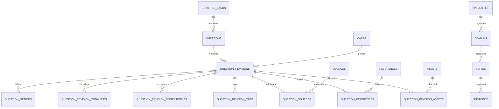

# Teaching

Teaching is an independently bounded education application hosted by the RISpro deployment. Phase 1 established its application, identity, permission, and API boundaries. Phase 2 adds the Teaching-owned taxonomy and question authoring foundation. Teaching remains independent from clinical RISpro workflows and data.

## Boundaries

- Backend entry point: `src/modules/teaching/index.ts`, mounted once at `/api/teaching` from `src/app.ts`.
- Frontend boundary: `frontend/src/teaching/`, mounted once at `/teaching/*` before the clinical route catch-all. Its router and layout are separate from `AppContent`.
- PostgreSQL-owned objects: the `teaching` schema and its Teaching-owned identity, taxonomy, and content tables, created by migrations `216_teaching_identity_foundation.sql` and `217_teaching_qbank_domain.sql`.
- Identity keys are the pair `(identity_issuer, identity_subject)`. Teaching stores no passwords, passkeys, clinical user foreign keys, patient data, or workflow records.
- Backend imports are limited to generic authentication, database, HTTP, and type infrastructure. `src/modules/teaching/tests/teaching-isolation.test.ts` checks that production Teaching files do not import the listed clinical domains.
- Teaching-owned import and media metadata are created by `218_teaching_qbank_import_pipeline.sql`; this migration does not modify clinical tables.

## V1 authentication and permissions

Teaching currently uses the shared RISpro session through `TeachingAuthProvider` and its `RISproTeachingAuthAdapter`. Password and passkey login use the existing authentication operations. Teaching logout calls the adapter, which invalidates the shared RISpro session and returns the browser to `/teaching/login`.

The backend's `resolveLegacyTeachingBootstrapPermissions` is the single transitional mapping from RISpro roles: doctors receive `teaching.access` and `teaching.learn`; supervisors and super admins receive the current Teaching capability vocabulary. Those grants are written to Teaching-owned tables on first eligible access. Persisted Teaching grants are then authoritative, so clinical roles are not checked in Teaching pages or services. Other roles do not receive compatibility grants.

The capability vocabulary is owned by `src/modules/teaching/domain/teaching-permission.ts`. The initial API actively requires only `teaching.access`; the dashboard is an application-shell placeholder and contains no invented metrics.

## Route and settings isolation

- `/teaching/login` uses the existing password or passkey flow through the Teaching adapter.
- `/teaching` redirects to `/teaching/dashboard`.
- `/teaching/dashboard` requires persisted `teaching.access`.
- Teaching is not registered in the clinical page-access matrix or clinical Settings page. Doctor Workspace exposes a Teaching destination only when `/api/teaching/me` confirms `teaching.access`.

The issuer adapter and DTO are the intended seam for a later OIDC/SSO provider. The Teaching domain does not depend on Doctor Workspace services or workflows.

## Teaching content model

Migration `217_teaching_qbank_domain.sql` creates the initial independent catalog: specialties, domains, topics, subtopics, modalities, competencies, training levels, difficulty definitions, tags, and question banks. Taxonomy rows have stable codes and active flags. Domains belong to specialties; topics belong to domains; subtopics belong to topics. Classification is stored on each question revision, and composite foreign keys enforce that the selected hierarchy and question-bank specialty agree.

The migration seeds the Radiology specialty, ten initial domains, representative neuroradiology and liver topics/subtopics, nine imaging modalities, eleven competencies, four training levels, five difficulty values, representative tags, and the `radiology-main` bank. The seed contains no questions.

`teaching.questions` is the stable logical identity with an external ID and question-bank membership. `teaching.question_revisions` stores editable content and revision-specific classification, explanation, source provenance, references, assets, and authorship metadata. Supported V1 types are single-best-answer, image-based SBA, and case-based SBA. Each revision has two or more unique answer keys and exactly one correct answer, validated before persistence.

Draft revisions can be edited and submitted for review. A reviewer records a server-generated identity and review timestamp; a separate publish capability is required to publish an approved revision. Published content fields are immutable. A new revision clones the latest published content and relationships into the next draft number. A question can be retired without deleting its revisions; retirement closes its latest revision while preserving earlier published history.

Sources record where content originated and carry a revision-specific provenance relationship (`original`, `adapted`, `paraphrased`, `verbatim`, `inspired_by`, or `unknown`). References are separate reusable citations that support the explanation. Cases are Teaching-owned educational groupings with no required patient or PACS link. Asset metadata accepts JPEG, PNG, or WebP only. Phase 3 imports images from ZIP packages, sanitizes them, and stores them under Teaching-owned storage keys.

## Phase 2 API

All endpoints are mounted through the existing single Teaching router at `/api/teaching`:

| Endpoint | Capability |
| --- | --- |
| `GET /catalog` | `teaching.access` |
| `GET /admin/question-banks` | author, review, publish, or taxonomy management |
| `GET /admin/questions` and `GET /admin/questions/:id` | author, review, or publish |
| `POST /admin/questions`, `PATCH /admin/questions/:id/revisions/:revisionId`, `POST /admin/questions/:id/submit-review`, `POST /admin/questions/:id/new-revision` | `teaching.author` |
| `POST /admin/questions/:id/revisions/:revisionId/review` | `teaching.review` |
| `POST /admin/questions/:id/publish`, `POST /admin/questions/:id/retire` | `teaching.publish` |
| `POST /admin/sources` | `teaching.manage_sources` |
| `POST /admin/references`, `POST /admin/cases` | `teaching.author` |

`teaching.admin` is the Teaching-specific administrative override. Every content write is transactional and derives its audit identity from the authenticated Teaching identity. Database unique/partial indexes prevent duplicate external IDs, simultaneous open revisions, duplicate option keys, and multiple correct options. Parent-question locks serialize authoring lifecycle transitions and revision numbering. Stable API DTOs omit clinical-user and workflow records.

## Phase 3 import pipeline

The import pipeline is part of the Teaching module and does not call an AI service. An author downloads a template built from the current active catalog and question banks, prepares JSON manually or with an external AI tool, uploads a `.json` file or `.zip`, reviews structural inspection, previews catalog and identifier validation, then confirms the batch. Confirmation creates new questions as revision 1 in `draft` status through the canonical Teaching content services. Existing external IDs block the batch; import does not overwrite or revise existing questions. Confirmation is transactional, and a failed write rolls back all content from that batch.

### Import API

All endpoints remain under the single Teaching mount at `/api/teaching` and require `teaching.author` (or `teaching.admin`):

| Endpoint | Purpose |
| --- | --- |
| `GET /qbank/import/template.json` | Download the current versioned JSON template, active taxonomy/bank catalog, AI instructions, and synthetic examples. |
| `POST /qbank/import/inspect` | Accept one JSON or ZIP file and create a short-lived import batch; this does not write questions or permanent assets. |
| `POST /qbank/import/preview` | Validate a batch against the current catalog, sources, cases, assets, and existing question IDs without writing content. |
| `POST /qbank/import/confirm` | Revalidate and atomically create questions, revision data, cases, references, sources, and assets. |
| `GET /qbank/import/batches` | List sanitized import audit summaries without the retained source payload. |
| `GET /qbank/import/batches/:id` | Read one sanitized import batch summary without the retained source payload. |

### JSON format and provenance

The root object uses `schemaVersion: "1.0"` and a `questions` array. Only that array contains importable content; template instructions, examples, and catalog metadata are descriptive. A version-specific parser registry currently accepts only `1.0`; future formats need an explicit adapter. The template is generated from the live Teaching catalog, and import validation uses the live catalog again. Taxonomy fields are stable codes, not display labels. Unknown fields and server-owned IDs, identity, timestamps, reviewer, publisher, or lifecycle fields are rejected. Imported status is always `draft` regardless of submitted values.

Each question includes an `externalId`, `classification`, `type`, `stem`, answer `options`, `answerKey`, `explanation`, optional `source`, provenance relationship, `references`, `generation`, optional `media`, and optional case linkage/metadata. Current supported question types are single-best-answer, image-based SBA, and case-based SBA. The importer requires exactly one correct answer for these types. Source and citation years must be four-digit years, and supplied URLs/DOIs receive syntax checks without external requests. An unknown or absent source must not be made up; each question retains its own source relationship even when multiple questions share one source record. `original` and `unknown` source types may have a null title. JSON may contain text-only questions; embedded/base64 images are not accepted. Case narratives must be de-identified educational material; do not include patient identifiers, accession numbers, or PACS identifiers.

### ZIP and media safety

A ZIP must contain a root `questions.json` and may contain flat files directly under `assets/`. Nested paths, path traversal, symbolic links, unsupported file types, and duplicate normalized filenames are rejected. Each image must be a JPEG, PNG, or WebP whose extension and decoded content agree. Images are decoded and re-encoded to remove metadata before staged use. Images are referenced in JSON by filename and `assetKey`; ZIP bytes and staged images are held outside the public web root until confirmation.

The current limits are 12 MB for JSON, 32 MB for a ZIP, 256 ZIP entries, 250 images, 100 MB expanded ZIP content, 8 MB per image, and 40 million pixels per image. An inspected batch expires after 24 hours. Inspection/preview writes only Teaching import-batch metadata and temporary staged files. Confirmation promotes files and inserts Teaching records in one DB transaction; promoted files are removed if the transaction fails. Successful, invalid, and expired batches discard their retained JSON payload and temporary staged files. Generic cleanup runs during import requests; the staging directory is also swept for old orphaned batches.

Warnings such as missing source, incomplete exam details, absent option explanation, unused ZIP images, or defaulted difficulty are visible during preview. Errors such as invalid hierarchy, unsafe/missing image, contradictory case metadata, unsupported type, or existing IDs block confirmation. A batch is revalidated at confirmation to catch catalog or identifier changes after preview. The batch audit records uploader, confirm actor, status, counts, validation summary, a sanitized failure reason where applicable, and revision lineage, but batch list/detail responses never return the retained import payload or question previews. An unexpected transaction error rolls back content, marks the batch failed, and removes its retained payload and staged assets; the author can upload it again after addressing the failure. A unique-ID race marks the batch invalid and requires upload/validation again.

### Frontend and operational boundary

The importer is routed at `/teaching/admin/import` inside the Teaching router and Teaching layout; it is available to Teaching authors/admins only. The main RISpro JSON body parser bypasses this exact multipart inspect route, and Teaching parses its single file itself. The downloaded template contains synthetic examples, never real question data. AI use is manual: RISpro does not send educational content to an AI service.

This phase still adds no learner sessions, attempts, progress, exams, bookmarks, notes, reset cycles, teaching analytics, courses, or lectures. No Teaching administration or taxonomy UI is added to clinical Settings.

## Phase 4 — Q-Bank editorial workflow

The Teaching layout now exposes the administrative Question Bank worklist to authors, reviewers, and publishers. Faculty can open an imported or manually created Draft, inspect its Teaching case/media and import lineage, edit structured content and classification, validate it, submit it for review, record a review decision, publish it, create a later Draft revision, inspect prior revisions, and retire the current content without deleting history.

Question listing is server-paginated (default 25, maximum 100) and applies search/filter conditions before pagination. It supports external ID/stem/source/case search, status, specialty, domain, topic, subtopic, type, difficulty, training level, tag, source type, image presence, imported/manual origin, batch, sort, and direction. Sorting is allow-listed and uses deterministic secondary ordering. The frontend keeps worklist filters in the URL. Migration `219_teaching_editorial_concurrency.sql` adds the Draft revision version and supporting tag-filter index; it also stores revision-specific image alt text.

### Editorial permissions and lifecycle

| Capability | Editorial actions |
| --- | --- |
| `teaching.author` | Create/edit Drafts, validate, submit for review, and create a new Draft from a published revision. |
| `teaching.review` | Review an unreviewed In Review revision or return it to Draft. |
| `teaching.publish` | Publish an approved In Review revision and retire the current question. |
| `teaching.manage_sources` | Create reusable Teaching sources. |
| `teaching.admin` | Teaching-specific override for the editorial capabilities. |

The existing transitional supervisor/super-admin compatibility mapping remains the source of bootstrap grants; Phase 4 adds no permission-provisioning system. Server checks are authoritative. A learner with only `teaching.access` / `teaching.learn` cannot open editorial routes or write editorial content.

Draft updates require the revision's expected `version`. A stale update returns HTTP 409 so the editor cannot silently overwrite another faculty member's changes. Submit, review, return, publish, new-revision, and retirement transitions update revision versions while holding the question lock. Published question content is immutable. Corrections require a new Draft revision, which clones the latest published revision and leaves it intact. Retirement preserves the complete question and revision history.

Before submission, the domain reparses the question and rechecks taxonomy and related Teaching records. Before publication it also verifies the exact-one-correct-answer rule, valid classification, required image for image-based SBA, and availability of attached Teaching assets. The UI presents domain errors separately from educational metadata warnings. Source provenance and supporting references remain separate records and separate editor sections. Normalized existing sources/references can be searched and reused; source type-specific fields are collected for textbook and exam records.

Import lineage shown in the editor and batch detail is read-only. It includes the batch ID, original filename, import timestamp, importing identity, schema version, and safe batch counts/status where present. Retained import payloads and permanent storage paths are never returned to the browser. AI-authorship metadata remains distinct from review and publication audit.

### Teaching asset preview and upload

`GET /api/teaching/assets/:id` serves only database-registered Teaching JPEG/PNG/WebP files, after validating the Teaching storage-key shape and resolving the path under the configured upload root. The response is inline, private/no-store, nosniff, and sandboxed; missing or invalid files return 404. It does not use clinical documents, PACS, or arbitrary path parameters.

Authors can attach existing Teaching images or upload JPEG, PNG, and WebP files to a Draft. `POST /api/teaching/admin/assets` accepts one multipart `file` part and uses the same decoder, size/pixel/frame limits, rotation, metadata stripping, re-encoding, random Teaching storage key, and MIME/extension checks as the Phase 3 ZIP importer. The response contains safe asset metadata only. Revision-specific alt text is saved with the Draft. Manual uploads are reusable Teaching assets even if the author does not attach them immediately.

### Phase 4 API and boundary

The Question Bank APIs remain under the single `/api/teaching` mount. `GET /admin/questions` returns `{ items, pagination }`, with page, pageSize, total, totalPages, limit, and offset. `GET /admin/sources`, `/admin/references`, `/admin/cases`, and `/admin/assets` return bounded search results for editorial pickers. `POST /admin/assets` is the sanitized manual image upload. Existing create/update/lifecycle routes continue to delegate to the canonical Teaching content service; expected revision versions are required for Draft PATCH requests.

Phase 4 adds only faculty administration and the protected preview path. It does not add a learner question player, answering, exams, sessions, attempts, progress, bookmarks, notes, study cycles, or analytics. Those remain outside this application milestone.

## Phase 5 — Learner Q-Bank and sessions

Migration `220_teaching_learner_sessions.sql` adds learner-owned sessions, session question snapshots, immutable attempts, current question state, bookmarks, and private notes to the existing `teaching` schema. It does not modify clinical tables. Learner APIs require both `teaching.access` and `teaching.learn`; the persisted Teaching identity `(identity_issuer, identity_subject)` scopes every session and private learner record.

`GET /api/teaching/qbank/dashboard` returns the count of currently published questions, current per-question progress counts, active session continuation, and recent sessions. `POST /api/teaching/qbank/availability` counts matching questions without returning their content. `POST /api/teaching/sessions` validates filters and randomly samples the requested number of currently published questions. If fewer questions match than requested, it returns HTTP 422 with the available count. The saved question order is reused on every resume.

**Session questions bind to exact published revisions at session creation.** Selection chooses the latest published revision for each non-retired logical question, so a later Draft is ignored and a subsequently published revision affects only new sessions. The session snapshot stores the question ID, revision ID, and position. Database constraints and a trigger prevent changing or deleting that snapshot. Answer choices retain their authored order.

`/teaching/qbank` is the learner session builder, `/teaching/qbank/session/:sessionId` is the question player and submitted-session review, and `/teaching/history` lists active and submitted sessions with pagination. The builder uses the current active Teaching taxonomy for specialty, domain, topic, subtopic, modality, competency, training level, difficulty, and tag filters, plus the learner's current state (`all`, `unseen`, `correct`, `incorrect`, `answered`, or `marked`). Review sessions default to incorrect questions and can target incorrect, marked, or previously answered questions.

Study and Review sessions create an attempt when a question is submitted. The server checks the selected option against the stored revision, records correctness, updates current question state, and immediately returns feedback. A repeated identical submission returns the same result; a different answer cannot replace it. **Finalized attempts are immutable.** Database triggers reject direct updates and deletes, and one attempt per session question is enforced by a unique constraint. A later session creates a separate attempt and updates current state while preserving the earlier event.

Exam responses are mutable draft selections stored on `teaching.session_questions`; they do not create attempts. Before whole-session submission, Exam delivery omits correctness flags, correct-option data, option explanations, and feedback. Submission locks the session and transactionally converts each answered draft into one immutable attempt, leaves unanswered questions without attempts, and makes review data available. Submission is idempotent. The result percentage uses all session questions as its denominator; answered accuracy uses only answered questions and is labeled separately.

Timed Exam sessions persist `started_at` and `time_limit_seconds`. The server calculates remaining time from those timestamps; a browser countdown is display-only. A server request that observes expiry finalizes the Exam through the same locked, idempotent submission path. Refreshing or returning to an active session restores its question order, saved Exam choices, current position, and remaining time.

Learner DTOs are serialized separately from editorial question DTOs. They omit source provenance, import lineage, authorship, reviewer/publisher data, and all answer material before the appropriate feedback point. Question images use the existing protected Teaching asset URL; learner-only asset reads are limited to published question images or revisions in that learner's own sessions. Bookmarks and notes attach to the logical question and persist across sessions. Notes are private to their Teaching identity and are not returned by editorial APIs.

The learner dashboard reports current-cycle counters and links to `/teaching/progress` for cycle and lifetime statistics.

## Phase 6: study cycles and learner analytics

Migration `221_teaching_study_cycles_analytics.sql` creates `teaching.study_cycles`. A cycle row belongs to one learner, question bank, and exact bank/domain/topic scope. Reset events create new temporal boundaries for the selected scope and its descendants. A bank reset starts new boundaries for the bank and its domains/topics; a domain reset starts new boundaries for that domain and its topics; a topic reset changes only that topic. A question's effective start is the latest applicable bank, domain, or topic boundary. This makes a broader reset supersede every narrower boundary inside it, while a later narrow reset supersedes its parent for only that scope.

Phase 5 attempts remain the immutable learning-event ledger. Existing attempts are treated as the learner's initial cycle; no migration backfill relabels or changes attempts. When a reset first closes an implicit initial cycle, the service saves a snapshot for the exact scope. Later closed cycles retain eligible, attempted, correct, incorrect, completion, and accuracy values so changes to the live question catalog cannot rewrite history. Reset is transactional and serialized per learner. Each reset request carries an idempotency UUID, and a replay of that UUID does not create another cycle.

Current-cycle state comes from the latest finalized attempt per logical question whose session started at or after that question's effective cycle boundary. Using session start time keeps an already active session in the period where it began, even if the learner finishes an answer after resetting. Reset does not close or rewrite active sessions, session questions, drafts, or prior answers. The preview reports active sessions that overlap the requested scope before confirmation.

Current-cycle accuracy is the number of attempted questions whose latest current-cycle result is correct divided by unique questions attempted in that cycle. Completion is unique eligible questions attempted divided by currently eligible published questions. Draft, In Review, retired questions, and questions outside active bank/domain/difficulty eligibility do not enter the live denominator. A newly published eligible question appears as unseen and may increase that denominator. Retired-question attempts remain in lifetime history. Bookmarks and notes are separate from question state and survive every reset.

Lifetime statistics use all finalized attempts in the selected bank, including attempts on questions later retired. First-pass accuracy takes the correctness of each logical question's first-ever attempt, then divides correct first attempts by unique questions with a lifetime attempt. It is independent of resets. Average answer time uses non-null durations from 1 ms through 24 hours; the UI labels its lifetime sample separately from current-cycle accuracy.

`GET /api/teaching/progress` returns a bank summary with distinct `currentCycle` and `lifetime` sections. `GET /api/teaching/progress/breakdown` aggregates by domain, topic, modality, competency, difficulty, or tag using the live catalog. Multi-modality and multi-competency questions contribute to every assigned category. Topic analytics can be filtered to a domain; tag results are searchable and limited to a useful set. Each dimension includes eligible/attempted counts, current correct/incorrect results, first-pass counts, and answer-time sample data. No learner percentages are presented without their counts.

`GET /api/teaching/progress/preview` supplies scope counts and active-session overlap for reset confirmation. `POST /api/teaching/progress/reset` starts a new bank/domain/topic cycle without deleting attempts, session history, bookmarks, notes, or question revisions. `GET /api/teaching/progress/cycles` returns the current cycle and read-only snapshots of closed cycles. All these APIs require `teaching.access` and `teaching.learn`, derive identity from the authenticated Teaching session, set private no-store cache headers, and expose only the caller's data.

The Progress page separates Current Cycle from Lifetime, shows domain/topic and other classification breakdowns with sample counts, exposes cycle history, and explains that resets preserve prior attempts. Faculty/cohort analytics, psychometrics, confidence scoring, recommendations, assignments, adaptive learning, and spaced repetition are outside this phase.